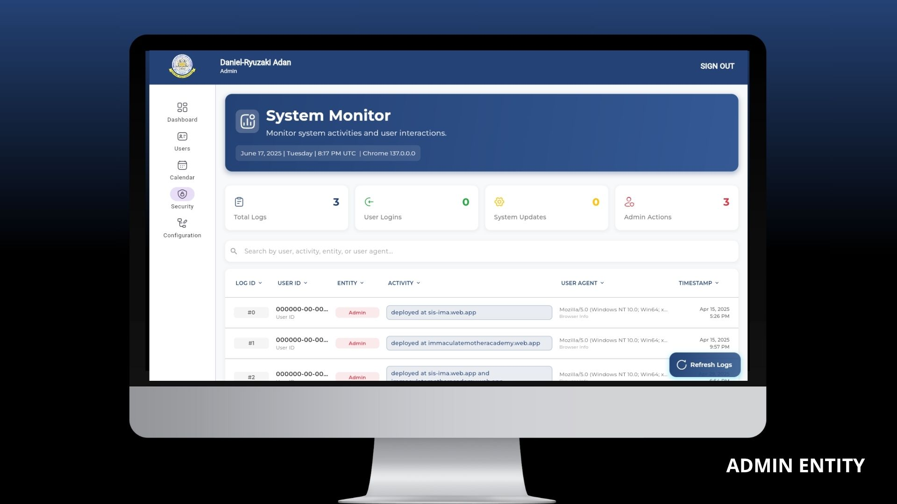
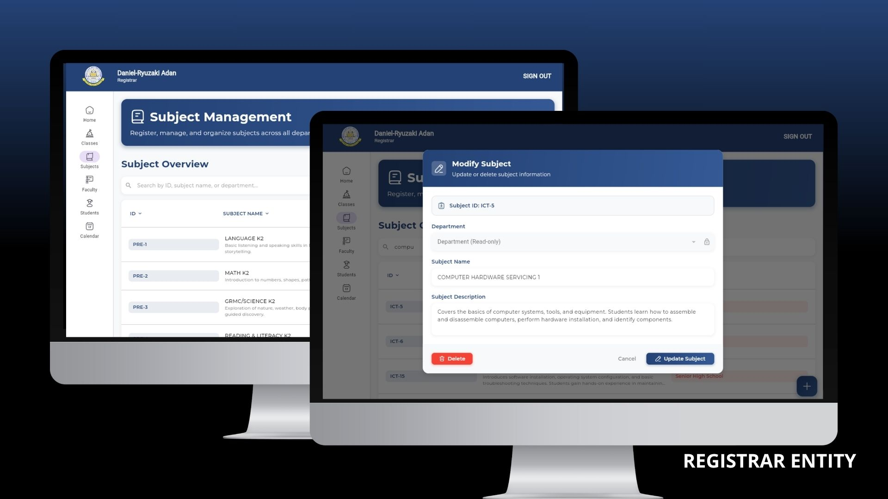

# 📚 IMA WebHub: Student Information System (SIS)
[](https://facebook.com/ryuzaxify)

[](https://github.com/DanRyuzaki/sis-ima-webhub) 
[](https://github.com/DanRyuzaki/sis-ima-webhub) 
[](https://creativecommons.org/licenses/by-nc-nd/4.0/)

[](https://sis-ima.web.app/) [](https://immaculatemotheracademy.web.app/)


A SPA-PWA-based Student Information System built using the Flutter SDK, designed to streamline student data management for Immaculate Mother Academy, Inc. (406747).

As part of a system acquisition initiative led and developed by Ryuzaki Systems, this project was designed and implemented by the college students from National University – Fairview:
 - **Aziel Tornea**
 - Patrick Oliveros
 - John Gabriel Tadeo
 - Darren Avila
 
The system supports progressive web application (PWA) functionality, ensuring cross-platform accessibility and a seamless user experience across devices.

### ⌨๋࣭ ⭑✮💻₊ ⊹ Technologies 


- Flutter
- Firebase Firestore
- Firebase Authentication
- EmailJS

### :fire: Features

| 🔑 Admin Entity                             | 🖱 Registrar Entity                  | 👩‍🏫 Faculty Entity                      | ✏️ Student Entity                      |
|-----------------------------------------------|--------------------------------------|-----------------------------------------|-----------------------------------------|
| :white_check_mark: System Overview          | :white_check_mark: Registrar Overview & Announcements | :white_check_mark: Educator Overview & Announcements | :white_check_mark: View Institutional Announcements 
| :white_check_mark: Manage School Announcements              | :white_check_mark: Manage Classes    | :white_check_mark: Manage Advisory/Subject Classes | :white_check_mark: Manage Student Profile |
| :white_check_mark: Manage All Entities             | :white_check_mark: Manage Subjects    | :white_check_mark: Handle Advisory Students' Information       | :white_check_mark: View Grades |
| :white_check_mark: Manage School Calendar            | :white_check_mark: Manage Faculty    | :white_check_mark: Manage Student Grades    | :white_check_mark: View Classes Information and Schedules |
| :white_check_mark: View System Monitor              | :white_check_mark: Manage Students    | :white_check_mark: View School Calendar    | :white_check_mark: View School Calendar |
| :white_check_mark: Manage Configuratives   | :white_check_mark: Manage Students    |
|                              | :white_check_mark: View School Calendar    |

---


### ʚ🐞ྀིྀིɞ Current Lapses 
- 🐞 Spark Service Plan via Firebase causes delays and data fetch latency
- 🐞 Class Modification has minor CRUD failures 


---

### :camera: Screenshots

| **Welcome Page** ★彡 |
|----------------|
|  |

| **Admin Entity** ★彡 |
|----------------|
|  |
|  |
|  |
|  |
|  |
|  |
|  |

| **Registrar Entity** ★彡 |
|----------------|
|  |
|  |
|  |
|  |
|  |
|  |

| **Faculty Entity** ★彡 |
|----------------|
|  |
|  |
|  |
|  |
|  |
|  |

| **Student Entity** ★彡 |
|----------------|
|  |
|  |
|  |
|  |

---

### 📜 License

```

Licensed under the Creative Commons Attribution-NonCommercial-NoDerivatives 4.0 International License (the "License");
you may not use this file except in compliance with the License. You may obtain a copy of the License at:

    https://creativecommons.org/licenses/by-nc-nd/4.0/

Unless required by applicable law or agreed to in writing, the code and related files distributed under the License are distributed on an "AS IS" BASIS,
without warranties or conditions of any kind, either express or implied. Under this license, you may not use the code for commercial purposes,
you may not distribute modified versions, and you may not sublicense or patent any part of the work. Forks and personal or educational inspection are permitted.

Copyright Ryuzaki Systems, 2025

```

---